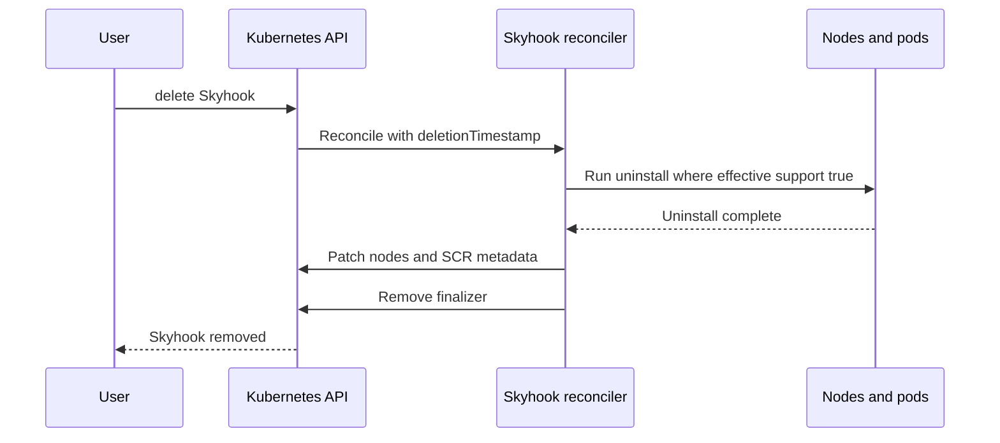

# Uninstall Enhancement design

This document specifies target behavior for Skyhook package uninstall, and Custom Resource instance finalizers.

## Problems

### Uninstall configuration loss
The way uninstall is triggered is by deleting a package definition. This has a major problem in that all the environment variables and configmaps will not be available to the package when it runs uninstall which breaks many assumptions on different packages and makes uninstall not usable.

### Label removal
Once uninstalled the labels and annotations need to be removed. However, not all packages actually support uninstall. So a package needs a way to let the operator know that it is okay to remove labels/annotations related to a package.

### Finalizer and uninstall
When a Skyhook Custom Resource is deleted the packages are not cleaned up. Finalizer should trigger an uninstall if the packages mark themselves as supporting uninstall.

## Goals

1. **No configuration loss on uninstall**: Uninstall workloads must receive the same class of inputs as apply (ConfigMap data, env vars, resources) by running uninstall **while the full package definition still exists** in the Skyhook spec.
2. **Explicit capability**: Only packages that **effectively** support uninstall may run uninstall hooks and may have package-scoped operator metadata removed afterward.
3. **Explicit trigger**: Uninstall is requested with `uninstall.apply`, not by deleting a package key from `spec.packages`.
4. **Safe removal**: Admission blocks removing a package from the spec until it is safe (uninstalled / absent from node state per defined rules).
5. **Skyhook deletion**: The existing Skyhook finalizer must orchestrate uninstall (when supported) before releasing the CR and cleaning SCR-related metadata.

## Feature flag: uninstall capability discovery

Automatic capability discovery (registry access, Tier 1 / Tier 2) is **off by default** and must be explicitly enabled via an **operator feature flag** (exact mechanism is implementation detail: e.g. Helm `values.yaml`, operator `Deployment` env var, or command-line flag).

| Flag | Behavior |
|------|----------|
| **Discovery disabled** (default) | The operator **does not** run Tier 1 or Tier 2. For `uninstall.enabled` **omitted / `null`** (`nil`), **effective** uninstall support is **`false`** (same as an explicit `false`). Uninstall hooks and post-uninstall metadata cleanup that depend on “supports uninstall” behave as **not supported** unless the user sets `uninstall.enabled: true` in the Skyhook spec. |
| **Discovery enabled** | When `uninstall.enabled` is `nil`, the operator may run [Capability discovery](#capability-discovery) (Tier 1 → Tier 2) and persist results per the rest of this document. |

Explicit **`uninstall.enabled: true`** or **`false`** in spec is always honored regardless of the flag; the flag only gates **automatic** discovery for the unset case.

## Current behavior (baseline)

Today, uninstall is driven largely by **spec drift** relative to **node state**:

- In [`HandleVersionChange`](../../operator/internal/controller/skyhook_controller.go), when a package **no longer exists** in `spec.packages` but still appears in node state, the controller transitions it to `StageUninstall` (`!exists && packageStatus.Stage != StageUninstall`).
- For that path the controller builds a **synthetic** `Package` with only `PackageRef` and `Image` for uninstall pods. [`createPodFromPackage`](../../operator/internal/controller/skyhook_controller.go) mounts per-package ConfigMap volumes and env only from the `Package` struct, so uninstall runs **without** CR `configMap` / `env`.
- [`HandleFinalizer`](../../operator/internal/controller/skyhook_controller.go) on Skyhook delete uncordons nodes, removes the finalizer, and does **not** run uninstall pods.

The validating webhook in [`skyhook_webhook.go`](../../operator/api/v1alpha1/skyhook_webhook.go) implements `ValidateUpdate` for create/update but does **not** enforce rules for removing packages from `spec.packages`. `ValidateDelete` is a no-op.

---

## API changes

### `Package.uninstall` block

Extend each entry under `spec.packages` with:

```yaml
packages:
  foo:
    version: "1.0.0"
    image: ghcr.io/example/pkg
    configMap: { ... }
    env: [ ... ]
    uninstall:
      enabled: true   # see semantics below
      apply: true     # one-shot: request uninstall run
```

### `uninstall.enabled` — use `*bool` in Go / optional in CRD

| Representation | Meaning (discovery **enabled**) | Meaning (discovery **disabled**, default) |
|----------------|--------------------------------|-------------------------------------------|
| **Omitted / `null`** (`nil` in Go) | Operator may **discover** (Tier 1 → Tier 2) and **persist** (see [Capability discovery](#capability-discovery)). | **Effective support is `false`**; no registry or layer access. Same as explicit `false` for policy purposes. |
| **`false`** | Package **does not** support uninstall. | Same. |
| **`true`** | Package **supports** uninstall. | Same. |

When discovery is enabled, explicit non-nil values **override** discovery. During discovery, the controller will persist `true`/`false` into an annotation (see [Persistence](#persistence)).

### `uninstall.apply`

- When `true`, the reconciler should schedule uninstall for that package **while the package remains** in `spec.packages` with full `configMap`, `env`, etc.
- While uninstall is in progress state should be `uninstall_in_progress` to differeniate from the applicative `in_progress` state.
- After a **successful** uninstall on all relevant nodes, the package will be in an uninstalled state and the spec will remain unchanged. This will be a special state such that when the reconciler sees a package with `uninstall.apply=true` and the package is NOT in the node state annotation for a node it is considered to be in the `uninstalled` state and therefore does NOT run any apply, config, etc steps.

#### Failure modes

**Uninstall fails on some nodes**: This is the same as a failing install package and pods will continue to be scheduled until complete.

**Canceling an uninstall**: Removal of `uninstall.apply` or setting `uninstall.apply=false` or setting the pause or stop on the package/custom resource will halt scheduling of uninstall pods.

### Validation when `apply: true`

With the discovery flag **off** (default), **`uninstall.enabled` omitted** yields **effective `false`**, so `uninstall.apply: true` alone does **not** imply uninstall will run unless the user sets **`uninstall.enabled: true`**.

If `uninstall.apply` is `true` and **effective** uninstall support is `false`  **Reject** in validating admission.

---

## Capability discovery

Capability answers: “May this package run uninstall and may the operator strip package-scoped metadata after success?”

**Prerequisite**: This entire section applies **only when** the [uninstall capability discovery feature flag](#feature-flag-uninstall-capability-discovery) is **enabled**. If the flag is off, skip to treating `nil` `enabled` as effective **`false`** (no Tier 1, Tier 2, or registry calls).

### Persistence
**Persistence location after discovery:** annotation at `nodewright/repository@digest` or `nodewright/repository@SHA` when sha is set

**Persistence annotation value meanings**

* `true` - same as `uninstall.enabled=true`
* `false` - same as `uninstall.enabled=false`
* `unknown` - same as `uninstall.enabled=false` see failure modes for more

### Tier 1 — OCI image config / labels (cheap)

- Use a registry client (e.g. **google/go-containerregistry** or **containers/image**) to fetch **manifest + image config JSON** only — **no full layer pull**.
- Read **`config.Labels`** (OCI/Docker config). Read a label e.g `nodewright.nvidia.com/uninstall=enabled` (value convention TBD in implementation).
- **Auth**: Operator must use credentials available in the defined  `imagePullSecret` set at Operator deploy time
- Persist

**Execution context**: This should be done within the operator when the package is first seen.

### Tier 2 — First-seen filesystem `config.json` + persist `enabled`

- Stream **layer blobs** and inspect tar contents for a `/skyhook-package/config.json` inside the image (path is from the NodeWright package image contract) 
- Parse **`config.json`** using the schema defined at [agent/skyhook-agent/src/skyhook_agent/schemas](agent/skyhook-agent/src/skyhook_agent/schemas)
- Persist

### Failure modes

If all methods fail either because they do not return anything or package fetching fails for any reason set a `nodewright.nvidia.com/UninstallCapabilityUnknown` condition on the SCR. This should also be considered as an effective `false` for `uninstall.enabled`. To avoid loops it should set the persist annotation value to `unknown`

---

## Effective capability (`uninstallSupportedEffective`)

Use this single notion everywhere: reconciliation, finalizer, label cleanup, and (optionally) admission.

| Step | Rule |
|------|------|
| 0 | If the **discovery feature flag** is **off**, and `uninstall.enabled` is **`nil`**, **effective = `false`** (stop). If `enabled` is non-nil, use step 1 only. |
| 1 | If `spec.packages[name].uninstall.enabled` is **non-nil**, use that bool. |
| 2 | Else if **annotation** already stores the outcome for `(name, version, digest)`, use it. |
| 3 | Else run **Tier 1** (OCI labels). |
| 4 | If still unknown, run **Tier 2** **once** per `(name, version, digest)`, then persist per [Tier 2](#tier-2--first-seen-filesystem-configjson--persist-enabled). |
| 5 | If registry is unreachable and there is no cache, set `nodewright.nvidia.com/UninstallCapabilityUnknown` condition; policy for allowing `uninstall.apply` while unknown is: **block** uninstall pods until resolved or user sets `enabled` explicitly. |

---

## Trigger semantics

### Stop using “remove package key” as uninstall trigger

- Remove the branch that starts uninstall when the package is **missing** from `spec.packages` (today `!exists` in `HandleVersionChange`).
- **New**: Uninstall runs when `uninstall.apply: true` and effective support is true, with the **full** `Package` from spec passed into pod creation.

### Version upgrade / downgrade

Keep existing flows where the spec still names the package but **version** changes: upgrade/downgrade logic that uses `StageUninstall` / `StageUpgrade` may remain, with a documented caveat: **downgrade** uninstall of the *old* version may see **new** version’s `configMap` in spec. Document this issue and provide work around examples such as uninstalling before apply if inducing a downgrade.Further enhancement of this is out of scope for this design.

### Admission: “reject delete”

Implement **validating admission** in [`SkyhookWebhook.ValidateUpdate`](../../operator/api/v1alpha1/skyhook_webhook.go):

- For each package key **present** in `old.Spec.Packages` and **absent** in `new.Spec.Packages`, **reject** unless the package is **safe to remove**.

**Safe to remove**: At least one of the following is true:
 * `uninstall.enabled=True` or discovered capability is true and For package name `P`, for **every** node, `status.nodeState[node]` has **no** `PackageStatus` for `P` at any version
 * `uninstall.enabled=False` or discovered capability is false

---

## Reconciliation

- When `uninstall.apply` is true and **effective** support is true: create uninstall pods using the **real** `*Package` from `spec.packages[name]` (same path as [`createPodFromPackage`](../../operator/internal/controller/skyhook_controller.go)), not the minimal synthetic package.
- When effective support is false: **do not** run uninstall containers; **do not** remove package-scoped labels/annotations or node state
- On successful uninstall for a capable package: remove entries from node state as today (see [`pod_controller`](../../operator/internal/controller/pod_controller.go) handling of `StageUninstall`).

---

## Label and annotation cleanup

- **Per package**: After successful uninstall, if **effective** support was true:
  - remove operator-managed keys **scoped to that package** where they exist. Today much of node metadata is **per Skyhook** (`skyhook.nvidia.com/status_<skyhook>`, `nodeState_<skyhook>`, etc. in [`wrapper/node.go`](../../operator/internal/wrapper/node.go)); the implementation should enumerate which keys are truly per-package (e.g. pod labels `skyhook.nvidia.com/package`) vs per-SCR and only remove what is correct.
  - zero out metrics related to that package and remove them from being reported.
- **Skyhook (SCR)**: When **all** packages are uninstalled / absent from node state per policy, either **remove** SCR labels/annotations the operator owns for rollout.

---

## Finalizer on Skyhook delete

Extend [`HandleFinalizer`](../../operator/internal/controller/skyhook_controller.go) (or a dedicated phase invoked from it):

1. While `metadata.deletionTimestamp` is set and the Skyhook finalizer is present, if any node still has state for packages whose **effective** uninstall support is true, **run the same uninstall orchestration** as `uninstall.apply` (the **spec is still available** until the object is removed).
2. Packages **without** uninstall support: **skip** uninstall pods; node metadata should be kept for packages that do not support uninstall so that users may still know that those packages have been applied to the nodes.
3. When obligations are met, perform existing behavior (uncordon, metrics, remove finalizer) and **SCR metadata cleanup** per above.



---

## Migration and testing

- **Breaking change**: Clusters that rely on “remove package from spec → uninstall” must move to **`uninstall.apply: true`** before removing keys, subject to admission rules.
- **Chainsaw**: [`k8s-tests/chainsaw/skyhook/uninstall-upgrade-skyhook`](../../k8s-tests/chainsaw/skyhook/uninstall-upgrade-skyhook) currently documents removal-driven uninstall; update scenarios for `uninstall.apply`, discovery (with flag on/off), and admission.
- **Docs**: User-facing README / operator docs should describe uninstall, the discovery feature flag (default off), explicit `uninstall.enabled: true` when discovery is off, and GitOps implications.

---

## Status conditions

| Type | Purpose |
|------|---------|
| `nodewright.nvidia.com/UninstallCapabilityUnknown` | Registry/discovery failure; blocks on `apply` |
| `nodewright.nvidia.com/UninstallInProgress` | Set when finalizer is triggered |
| `nodewright.nvidia.com/UninstallFailed` | Set during finalizer for failures |

---

## References

- [`operator/internal/controller/skyhook_controller.go`](../../operator/internal/controller/skyhook_controller.go) — `HandleVersionChange`, `createPodFromPackage`, `HandleFinalizer`
- [`operator/internal/controller/pod_controller.go`](../../operator/internal/controller/pod_controller.go) — uninstall completion / node state
- [`operator/api/v1alpha1/skyhook_webhook.go`](../../operator/api/v1alpha1/skyhook_webhook.go) — admission extension points
- [`operator/internal/wrapper/node.go`](../../operator/internal/wrapper/node.go) — node labels/annotations
