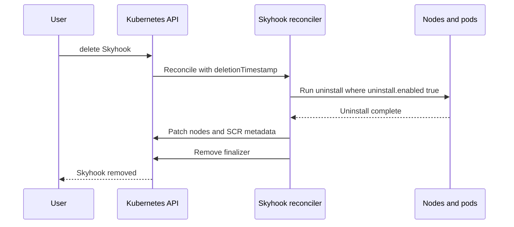

# Uninstall Enhancement design

This document specifies target behavior for Skyhook package uninstall, and Custom Resource instance finalizers.

Capability discovery from container images or registries (OCI labels, layer inspection, ORAS, etc.) is **out of scope** and may be covered by a separate design. This document assumes **`uninstall.enabled` is set only in the Skyhook spec** (boolean, no automatic discovery).

## Problems

### Uninstall configuration loss
The way uninstall is triggered is by deleting a package definition. This has a major problem in that all the environment variables and configmaps will not be available to the package when it runs uninstall which breaks many assumptions on different packages and makes uninstall not usable.

### Label removal
Once uninstalled the labels and annotations need to be removed. However, not all packages actually support uninstall. So a package needs a way to let the operator know that it is okay to remove labels/annotations related to a package.

### Finalizer and uninstall
When a Skyhook Custom Resource is deleted the packages are not cleaned up. Finalizer should trigger an uninstall if the packages mark themselves as supporting uninstall.

## Goals

1. **No configuration loss on uninstall**: Uninstall workloads must receive the same class of inputs as apply (ConfigMap data, env vars, resources) by running uninstall **while the full package definition still exists** in the Skyhook spec.
2. **Explicit capability in spec**: Only packages with **`uninstall.enabled: true`** may run uninstall hooks and may have package-scoped operator metadata removed afterward. There is **no** operator-driven discovery from images or registries in this design.
3. **Explicit trigger**: Uninstall is requested with `uninstall.apply`, not by deleting a package key from `spec.packages`.
4. **Safe removal**: Admission blocks removing a package from the spec until it is safe (uninstalled / absent from node state per defined rules).
5. **Skyhook deletion**: The existing Skyhook finalizer must orchestrate uninstall when **`uninstall.enabled`** is true before releasing the CR and cleaning SCR-related metadata.

## Current behavior (baseline)

Today, uninstall is driven largely by **spec drift** relative to **node state**:

- In [`HandleVersionChange`](../../operator/internal/controller/skyhook_controller.go), when a package **no longer exists** in `spec.packages` but still appears in node state, the controller transitions it to `StageUninstall` (`!exists && packageStatus.Stage != StageUninstall`).
- For that path the controller builds a **synthetic** `Package` with only `PackageRef` and `Image` for uninstall pods. [`createPodFromPackage`](../../operator/internal/controller/skyhook_controller.go) mounts per-package ConfigMap volumes and env only from the `Package` struct, so uninstall runs **without** CR `configMap` / `env`.
- [`HandleFinalizer`](../../operator/internal/controller/skyhook_controller.go) on Skyhook delete uncordons nodes, removes the finalizer, and does **not** run uninstall pods.

The validating webhook in [`skyhook_webhook.go`](../../operator/api/v1alpha1/skyhook_webhook.go) implements `ValidateUpdate` for create/update but does **not** enforce rules for removing packages from `spec.packages`. `ValidateDelete` is a no-op.

---

## API changes

### `Package.uninstall` block

Extend each entry under `spec.packages` with:

```yaml
packages:
  foo:
    version: "1.0.0"
    image: ghcr.io/example/pkg
    configMap: { ... }
    env: [ ... ]
    uninstall:
      enabled: true   # required semantics: see below
      apply: true     # one-shot: request uninstall run
```

### `uninstall.enabled`

Boolean in the API (e.g. **`+kubebuilder:default=false`** so omitted is treated as **false**).

| Value | Meaning |
|-------|--------|
| **`false`** (default) | Package **does not** support uninstall. The operator does **not** run uninstall pods, does **not** strip package-scoped metadata as if uninstall ran, and finalizer skips uninstall for this package. |
| **`true`** | Package **supports** uninstall. `uninstall.apply` may schedule uninstall work and post-success cleanup applies as described below. |

There is **no** `nil`/unset distinction beyond the CRD default: **unset behaves like `false`**.

### `uninstall.apply`

- When `true`, the reconciler should schedule uninstall for that package **while the package remains** in `spec.packages` with full `configMap`, `env`, etc., **only if** `uninstall.enabled` is **`true`**.
- While uninstall is in progress state should be `uninstall_in_progress` to differentiate from the applicative `in_progress` state.
- After a **successful** uninstall on all relevant nodes, the package will be in an uninstalled state and the spec will remain unchanged. This will be a special state such that when the reconciler sees a package with `uninstall.apply=true` and the package is NOT in the node state annotation for a node it is considered to be in the `uninstalled` state and therefore does NOT run any apply, config, etc steps.

#### Failure modes

**Uninstall fails on some nodes**: This is the same as a failing install package and pods will continue to be scheduled until complete.

**Canceling an uninstall**: Removal of `uninstall.apply` or setting `uninstall.apply=false` or setting the pause or stop on the package/custom resource will halt scheduling of uninstall pods.

### Validation when `apply: true`

If `uninstall.apply` is `true` and **`uninstall.enabled` is not `true`**, **reject** in validating admission.

---

## Uninstall support (single rule)

Use one rule everywhere: reconciliation, finalizer, label cleanup, and admission.

**Supports uninstall** iff `spec.packages[name].uninstall.enabled == true`.

---

## Trigger semantics

### Stop using “remove package key” as uninstall trigger

- Remove the branch that starts uninstall when the package is **missing** from `spec.packages` (today `!exists` in `HandleVersionChange`).
- **New**: Uninstall runs when `uninstall.apply: true` and **`uninstall.enabled: true`**, with the **full** `Package` from spec passed into pod creation.

### Version upgrade / downgrade

Keep existing flows where the spec still names the package but **version** changes: upgrade/downgrade logic that uses `StageUninstall` / `StageUpgrade` may remain, with a documented caveat: **downgrade** uninstall of the *old* version may see **new** version’s `configMap` in spec. Document this issue and provide work around examples such as uninstalling before apply if inducing a downgrade. Further enhancement of this is out of scope for this design.

### Admission: “reject delete”

Implement **validating admission** in [`SkyhookWebhook.ValidateUpdate`](../../operator/api/v1alpha1/skyhook_webhook.go):

- For each package key **present** in `old.Spec.Packages` and **absent** in `new.Spec.Packages`, **reject** unless the package is **safe to remove**.

**Safe to remove**: At least one of the following is true:

- **`uninstall.enabled` is `true`** and for package name `P`, for **every** node, `status.nodeState[node]` has **no** `PackageStatus` for `P` at any version (fully gone from state after uninstall).
- **`uninstall.enabled` is `false`**: the package never supported uninstall; removal from spec is allowed per policy without an uninstall run (see reconciliation: no automatic node-state purge required for unsupported packages beyond what is explicitly implemented).

---

## Reconciliation

- When `uninstall.apply` is true and **`uninstall.enabled` is true**: create uninstall pods using the **real** `*Package` from `spec.packages[name]` (same path as [`createPodFromPackage`](../../operator/internal/controller/skyhook_controller.go)), not the minimal synthetic package.
- When **`uninstall.enabled` is false**: **do not** run uninstall containers; **do not** remove package-scoped labels/annotations or node state as part of an uninstall path.
- On successful uninstall for a package with **`uninstall.enabled` true**: remove entries from node state as today (see [`pod_controller`](../../operator/internal/controller/pod_controller.go) handling of `StageUninstall`).

---

## Label and annotation cleanup

- **Per package**: After successful uninstall, if **`uninstall.enabled` was true**:
  - remove operator-managed keys **scoped to that package** where they exist. Today much of node metadata is **per Skyhook** (`skyhook.nvidia.com/status_<skyhook>`, `nodeState_<skyhook>`, etc. in [`wrapper/node.go`](../../operator/internal/wrapper/node.go)); the implementation should enumerate which keys are truly per-package (e.g. pod labels `skyhook.nvidia.com/package`) vs per-SCR and only remove what is correct.
  - zero out metrics related to that package and remove them from being reported.
- **Skyhook (SCR)**: When **all** packages are uninstalled / absent from node state per policy, either **remove** SCR labels/annotations the operator owns for rollout.

---

## Finalizer on Skyhook delete

Extend [`HandleFinalizer`](../../operator/internal/controller/skyhook_controller.go) (or a dedicated phase invoked from it):

1. While `metadata.deletionTimestamp` is set and the Skyhook finalizer is present, if any node still has state for packages with **`uninstall.enabled: true`**, **run the same uninstall orchestration** as `uninstall.apply` (the **spec is still available** until the object is removed).
2. Packages with **`uninstall.enabled: false`**: **skip** uninstall pods; node metadata should be kept for those packages so users may still know that those packages have been applied to the nodes.
3. When obligations are met, perform existing behavior (uncordon, metrics, remove finalizer) and **SCR metadata cleanup** per above.



---

## Migration and testing

- **Breaking change**: Clusters that rely on “remove package from spec → uninstall” must move to **`uninstall.apply: true`** (with **`uninstall.enabled: true`**) before removing keys, subject to admission rules.
- **Chainsaw**: [`k8s-tests/chainsaw/skyhook/uninstall-upgrade-skyhook`](../../k8s-tests/chainsaw/skyhook/uninstall-upgrade-skyhook) currently documents removal-driven uninstall; update scenarios for `uninstall.apply`, explicit `uninstall.enabled`, and admission.
- **Docs**: User-facing README / operator docs should describe uninstall and the requirement to set **`uninstall.enabled: true`** for packages that support uninstall.

---

## Status conditions

| Type | Purpose |
|------|---------|
| `UninstallInProgress` | Set when finalizer is triggered |
| `UninstallFailed` | Set during finalizer for failures |

---

## References

- [`operator/internal/controller/skyhook_controller.go`](../../operator/internal/controller/skyhook_controller.go) — `HandleVersionChange`, `createPodFromPackage`, `HandleFinalizer`
- [`operator/internal/controller/pod_controller.go`](../../operator/internal/controller/pod_controller.go) — uninstall completion / node state
- [`operator/api/v1alpha1/skyhook_webhook.go`](../../operator/api/v1alpha1/skyhook_webhook.go) — admission extension points
- [`operator/internal/wrapper/node.go`](../../operator/internal/wrapper/node.go) — node labels/annotations
